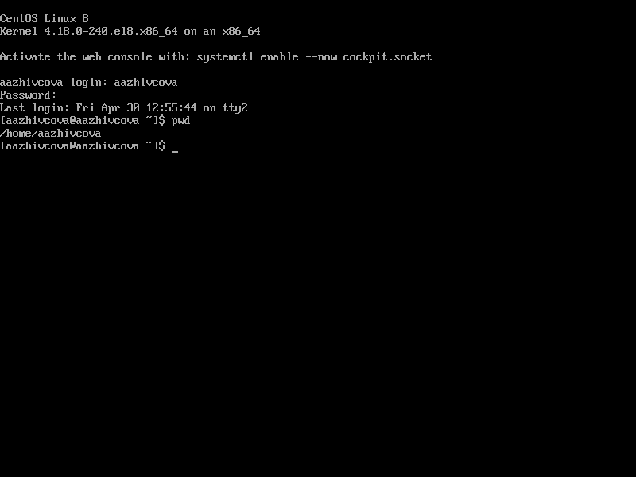
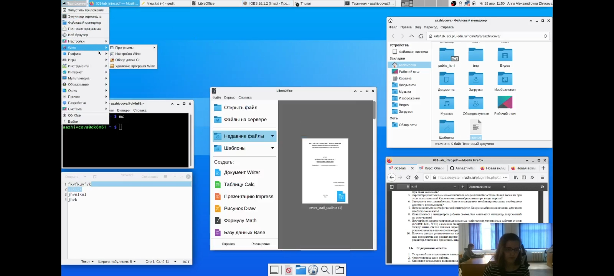
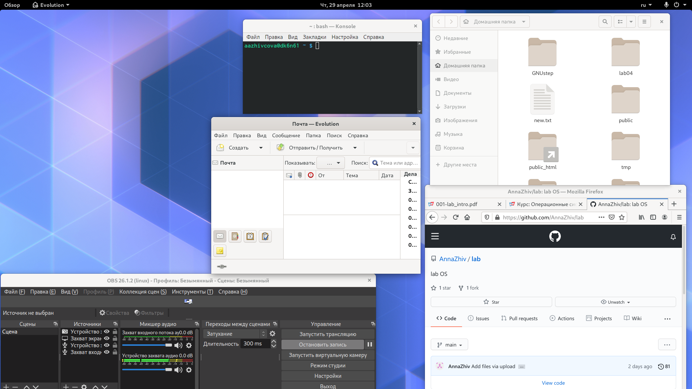

# Отчёт о выполнении лабораторной работы №4 Основы интерфейса взаимодействия пользователя с системой Unix на уровне командной строки
***Российский Университет Дружбы Народов***  
***Факульткт Физико-Математических и Естественных Наук***  

 ***Дисциплина:*** *Операционные системы*  
 
 ***Работу выполняла:*** *Живцова Анна*  
 
 *1032201673*  
 
 *НКНбд-01-20*  
 
 ***Москва. Дисплейный класс РУДН. 2021г.***  
 
 ---

 В ходе изучения курса "Операционные системы" передо мной встала следующая задача
 > *Познакомиться с операционной системой Linux, получить  практические навыки работы с консолью и некоторыми графическими менеджерами рабочих столов операционной системы.*
 
 ---

 Данная задача была разбита на следующие подзадачи:
- исользовать виртуальные консоли
- изучить графические интерфейсы
- ознакомится с менеджером рабочих столов

Изучив теоретический материал, мне удалось достигнуть поставленных целей.

---

я могу работать в разлличных графичиских интерфейсах и использовать виртуальные консоли.

---

---

---

---

## Вывод 
В ходе работы мне удалось выроботать навык работы разлличных графичиских интерфейсах и использования виртуальные консоли.
