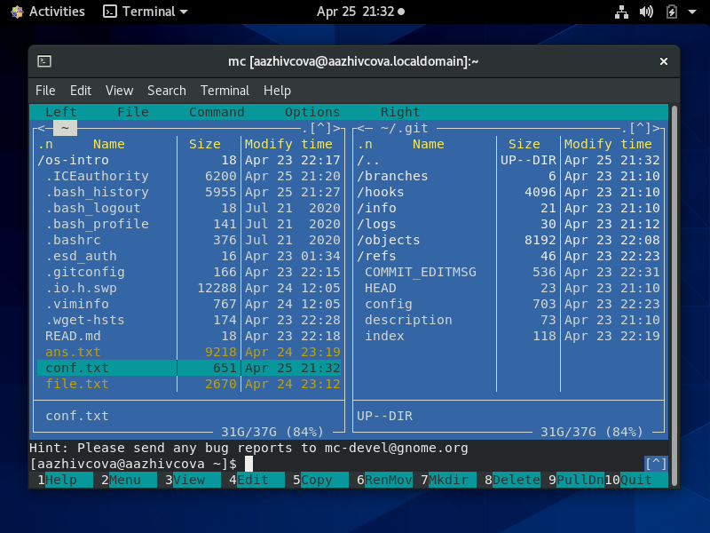
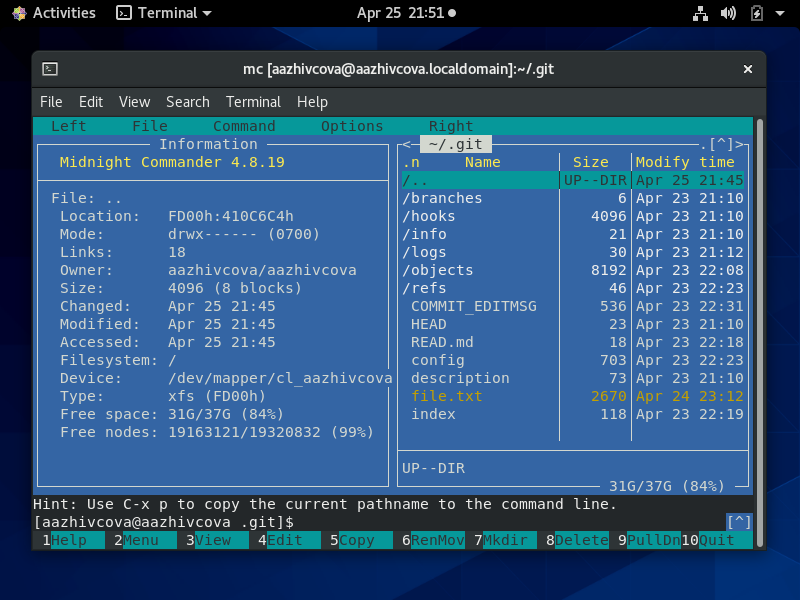
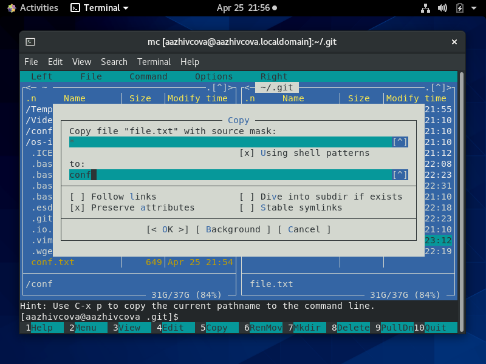

# Отчёт о выполнении лабораторной работы №8 Командная оболочка Midnight Commander
***Российский Университет Дружбы Народов***  
***Факульткт Физико-Математических и Естественных Наук***  

 ***Дисциплина:*** *Операционные системы*  
 
 ***Работу выполняла:*** *Живцова Анна*  
 
 *1032201673*  
 
 *НКНбд-01-20*  
 
 ***Москва. Дисплейный класс РУДН. 2021г.***  
 
 ---

 В ходе изучения курса "Операционные системы" передо мной встала следующая задача
 > *Освоение основных возможностей командной оболочки Midnight Commander. Приобретение навыков практической работы по просмотру каталогов и файлов; манипуляций с ними.*
 
 ---

 Данная задача была разбита на следующие подзадачи:
- работать с файлами через интерфейс Midnight Commander
- работать с файлами через текстовый редактор Midnight Commander

 Изучив теоретический материал, мне удалось достигнуть поставленных целей.

 --- 

Сейчас я могу в полной мере использовать Midnight Commander для различной работы с файлами.

 
 
 
 

 ---
 
 # Вывод
 В хоте работы я приобрела ряд полезных навыков в обращении,создании, перемещении, обработке, получении сведений, удалении, редактировании файлов и использовании горячих клавиш, а главное создала базу для выполнения следующих лабораторных работ.

