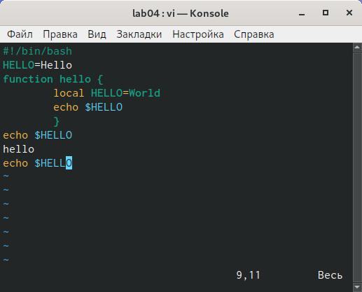

# Отчёт о выполнении лабораторной работы №9 Текстовой редактор vi
***Российский Университет Дружбы Народов***  
***Факульткт Физико-Математических и Естественных Наук***  

 ***Дисциплина:*** *Операционные системы*  
 
 ***Работу выполняла:*** *Живцова Анна*  
 
 *1032201673*  
 
 *НКНбд-01-20*  
 
 ***Москва. Дисплейный класс РУДН. 2021г.***  
 
## Цель работы 
Познакомиться с операционной системой Linux. Получить практические навы-ки работы с редактором vi, установленным по умолчанию практически во всех дис-трибутивах.
## Задание 
Задание 1.Создание нового файла с использованием vi
1. Создайте каталог с именем~/work/os/lab06.
2. Перейдите во вновь созданный каталог.
3. Вызовите vi и создайте файлhello.shvi hello.sh
4. Нажмите клавишуiи вводите следующий текст.
#!/bin/bash
HELL=Hello
functionhello{
LOCALHELLO=World
echo$HELLO
}
echo$HELLO
hello
5. Нажмитеклавишу Esc для перехода в командный режим после завершения ввода текста.
6. Нажмите:для перехода в режим последней строки и внизу вашего экранапоявится приглашение в виде двоеточия.
7. Нажмитеw(записать) иq(выйти), а затем нажмите клавишуEnterдля сохранения вашего текста и завершения работы.
8. Сделайте файл исполняемымchmod +x hello.sh6.3.2.  
Задание 2. Редактирование существующего файла
1. Вызовите vi на редактирование файлаvi ~/work/os/lab06/hello.sh
2. Установите курсор в конец словаHELLвторой строки.
3. Перейдите в режим вставки и замените на HELLO. Нажмите Esc для возврата вкомандный режим.
4. Установите курсор на четвертую строку и сотрите словоLOCAL.
5. Перейдите в режим вставки и наберите следующий текст : local, нажмите Esc для возврата в командный режим.
6. Установите курсор на последней строке файла. Вставьте после неё строку, со-держащую следующий текст:echo $HELLO.
7. Нажмите Esc для перехода в командный режим.
8. Удалите последнюю строку.
9.Введите команду отмены измененийuдля отмены последней команды.
10.Введите символ : для перехода в режим последней строки. Запишите произведённые изменения и выйдите из vi.

## Выполнение работы
### Задание 1.Создание нового файла с использованием vi
1. Создала каталог для лабораторной работы
2. Перешла во вновь созданный каталог.
3. Вызовала vi и создала файл hello.sh
4. Нажала клавишу i и ввела следующий текст.
5. Нажала клавишу Esc для перехода в командный режим после завершения ввода текста.
6. Нажала : для перехода в режим последней строки.
7. Нажала w(записать) и q(выйти), а затем нажала клавишу Enter для сохранения текста и завершения работы.
 
8. Сделала файл исполняемымchmod +x hello.sh6.3.2.  
### Задание 2. Редактирование существующего файла
1. Вызвала vi на редактирование файла viello.sh
2. Установила курсор в конец слова HELL второй строки.
3. Перешла в режим вставки и замените на HELLO. Нажала Esc для возврата вкомандный режим.
4. Установила курсор на четвертую строку и стерла слово LOCAL.
5. Перешла в режим вставки и наберала следующий текст : local, нажала Esc для возврата в командный режим.
6. Установила курсор на последней строке файла. Вставила после неё строку, содержащую следующий текст:echo $HELLO.
7. Нажала Esc для перехода в командный режим.
 
8. Удалила последнюю строку.
 
9.Ввела команду отмены изменений u для отмены последней команды.
10.Введите символ : для перехода в режим последней строки. Запишите произведённые изменения и выйдите из vi.
 
 
## Контрольные вопросы

> Познакомилась с операционной системой Linux. Получила практические навыки работы с редактором vi, установленным по умолчанию практически во всех дистрибутивах.
