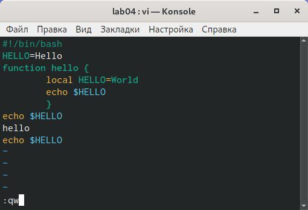

# Отчёт о выполнении лабораторной работы №9 Текстовой редактор vi
***Российский Университет Дружбы Народов***  
***Факульткт Физико-Математических и Естественных Наук***  

 ***Дисциплина:*** *Операционные системы*  
 
 ***Работу выполняла:*** *Живцова Анна*  
 
 *1032201673*  
 
 *НКНбд-01-20*  
 
 ***Москва. Дисплейный класс РУДН. 2021г.***  
 
 ---

 В ходе изучения курса "Операционные системы" передо мной встала следующая задача
 > *Познакомиться с операционной системой Linux. Получить практические навыки работы с редактором vi, установленным по умолчанию практически во всех дистрибутивах.*
 
 ---

 Данная задача была разбита на следующие подзадачи:
-  создать файл и открыть его с помощью vi
-  редактировать используя горячие клавиши

 Изучив теоретический материал, мне удалось достигнуть поставленных целей.

 --- 

Сейчас я могу в полной мере использовать vi для редактирования файлов.

 ---

---
 
 # Вывод
 
Познакомилась с операционной системой Linux. Получила практические навыки работы с редактором vi, установленным по умолчанию. 
