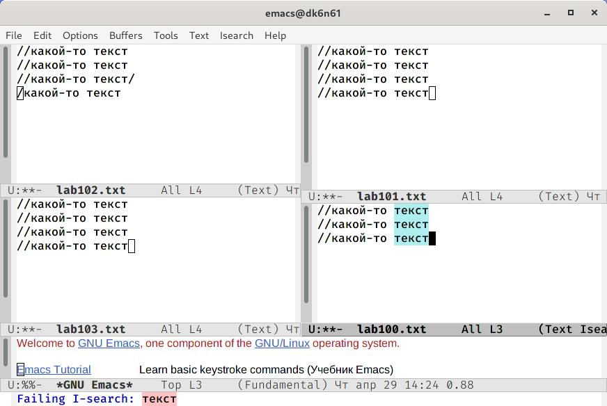

# Отчёт о выполнении лабораторной работы №10 Текстовой редактор emacs
***Российский Университет Дружбы Народов***  
***Факульткт Физико-Математических и Естественных Наук***  

 ***Дисциплина:*** *Операционные системы*  
 
 ***Работу выполняла:*** *Живцова Анна*  
 
 *1032201673*  
 
 *НКНбд-01-20*  
 
 ***Москва. Дисплейный класс РУДН. 2021г.***  
 
## Цель работы 
Познакомиться с операционной системой Linux. Получить практические навыки работы с редактором Emacs.
## Задание 
1. Открыть emacs.  
2. Создать файл lab07.sh с помощью комбинации Ctrl-x Ctrl-f (C-x C-f).  
3. Наберите текст:  
#!/bin/bash  
HELL=Hello  
function hello {  
LOCAL HELLO=World  
echo $HELLO  
}  
echo $HELLO  
hello  
4. Сохранить файл с помощью комбинации Ctrl-x Ctrl-s (C-x C-s).  
5. Проделать с текстом стандартные процедуры редактирования, каждое действие должно осуществляться комбинацией клавиш.  
    5.1. Вырезать одной командой целую строку (С-k).  
    5.2. Вставить эту строку в конец файла (C-y).  
    5.3. Выделить область текста (C-space).  
    5.4. Скопировать область в буфер обмена (M-w).  
    5.5. Вставить область в конец файла.  
    5.6. Вновь выделить эту область и на этот раз вырезать её (C-w).  
    5.7. Отмените последнее действие (C-/).  
6. Научитесь использовать команды по перемещению курсора.   
    6.1. Переместите курсор в начало строки (C-a).  
    6.2. Переместите курсор в конец строки (C-e).  
    6.3. Переместите курсор в начало буфера (M-<).  
    6.4. Переместите курсор в конец буфера (M->).  
7. Управление буферами.  
    7.1. Вывести список активных буферов на экран (C-x C-b).  
    7.2. Переместитесь во вновь открытое окно (C-x) o со списком открытых буферов и переключитесь на другой буфер.  
    7.3. Закройте это окно (C-x 0).  
    7.4. Теперь вновь переключайтесь между буферами, но уже без вывода их списка на экран (C-x b).  
8. Управление окнами.  
    8.1. Поделите фрейм на 4 части: разделите фрейм на два окна по вертикали (C-x 3), а затем каждое из этих окон на две части по горизонтали (C-x 2)  
    8.2. В каждом из четырёх созданных окон откройте новый буфер (файл) и введите несколько строк текста.
9. Режим поиска  
    9.1. Переключитесь в режим поиска (C-s) и найдите несколько слов, присутствующих в тексте.  
    9.2. Переключайтесь между результатами поиска, нажимая C-s.  
    9.3. Выйдите из режима поиска, нажав C-g.  
    9.4. Перейдите в режим поиска и замены (M-%), введите текст, который следуетнайти и заменить, нажмите Enter , затем введите текст для замены. После то-го как будут подсвечены результаты поиска, нажмите ! для подтверждениязамены.  
    9.5. Испробуйте другой режим поиска, нажав M-s o. Объясните, чем он отличается от обычного режима?  
## Выполнение работы
1. Открыла emacs.  (см рисунок ниже [открыла](lab10/1.jpg))  
 
2. Создала файл lab10.sh с помощью комбинации Ctrl-x Ctrl-f (C-x C-f).  
3. Наберала текст:  
#!/bin/bash  
HELL=Hello  
function hello {  
LOCAL HELLO=World  
echo $HELLO  
}  
echo $HELLO  
hello  
4. Сохранила файл с помощью комбинации Ctrl-x Ctrl-s (C-x C-s). (см рисунок ниже [создала](lab10/2.jpg)) 
 
5. Проделала с текстом стандартные процедуры редактирования, каждое действие осуществляла комбинацией клавиш.  
    5.1. Вырезала одной командой целую строку (С-k).  
    5.2. Вставила эту строку в конец файла (C-y).  (см рисунок ниже [вырезала и вставила](lab10/3.jpg)) 
     
    5.3. Выделила область текста (C-space).  
    5.4. Скопировала область в буфер обмена (M-w).  
    5.5. Вставила область в конец файла. (см рисунок ниже [скопировала и вставила область](lab10/4.jpg)) 
      
    5.6. Вновь выделила эту область и на этот раз вырезать её (C-w). (см рисунок ниже [вырезала область](lab10/5.jpg)) 
     
    5.7. Отменила последнее действие (C-/).  (см рисунок ниже [отменила](lab10/6.jpg)) 
     
6. Научилась использовать команды по перемещению курсора.  
    6.1. Переместила курсор в начало строки (C-a).  
    6.2. Переместила курсор в конец строки (C-e).  
    6.3. Переместила курсор в начало буфера (M-<).  
    6.4. Переместила курсор в конец буфера (M->).  
7. Управление буферами.  
    7.1. Вывела список активных буферов на экран (C-x C-b). (см рисунок ниже [список буферов](lab10/7.jpg)) 
       
    7.2. Переместилась во вновь открытое окно (C-x) o со списком открытых буферов и переключилась на другой буфер.  (см рисунок ниже [другой буфер](lab10/8.jpg)) 
       
    7.3. Закрыла это окно (C-x 0).  (см рисунок ниже [закрыла](lab10/9.jpg)) 
        
    7.4. Теперь вновь переключилась между буферами, но уже без вывода их списка на экран (C-x b).  (см рисунок ниже [другой буфер](lab10/10.jpg)) 
       
8. Управление окнами.  
    8.1. Поделила фрейм на 4 части: разделила фрейм на два окна по вертикали (C-x 3), а затем каждое из этих окон на две части по горизонтали (C-x 2) (см рисунок ниже [разделила](lab10/11.jpg)) 
      
    8.2. В каждом из четырёх созданных окон открыла новый буфер (файл) и ввела несколько строк текста. (см рисунок ниже [заолнила 4 файла текстом](lab10/12.jpg)) 
       
9. Режим поиска  
    9.1. Переключилась в режим поиска (C-s) и нашла несколько слов, присутствующих в тексте. (см рисунок ниже [нашла слова](lab10/13.jpg)) 
      
    9.2. Переключилась между результатами поиска, нажимая C-s.  (см рисунок ниже [между результатами](lab10/14.jpg)) 
      
    9.3. Вышла из режима поиска, нажав C-g.  
    9.4. Испробовала другой режим поиска, нажав M-s o. (см рисунок ниже [другой режим](lab10/15.png)) 
     
## Контрольные вопросы 
1. Emacs представляет собой мощный экранный редактор текста, написанный на языке высокого уровня Elisp.    
2. Буфер может содержать что угодно, например, результаты компиляции программы или встроенные подсказки. Практически всё взаимодействие с пользователем, в том числе интерактивное, происходит посредством буферов.   
3. Буфер — объект, представляющий какой-либо текст.  Окно — прямоугольная область фрейма, отображающая один из буферов.  
4. нет   
5. После запуска Emacs без каких-либо параметров в основном окне отображается буфер *scratch*, который используется для оценки выражений Emacs Lisp, а также для заметок, которые вы не хотите сохранять. Этот буфер не сохраняется автоматически.  
6.  C-c | == ctrl+c+shift+|    C-c C-| ==  ctrl+c  ctrl+shift+|
7. Oкнo на две части по горизонтали (C-x)
8. Настройки emacs хранятся в файле .emacs, который хранится в домашней дирректории пользователя. Кроме этого файла есть ещё папка .emacs.d, где хранятся дополнительные файлы настроек, подключаемые модули, временные файлы emacs и т.п.  
9. <- в сочетании с ctrl+x cлужит для переключение между активными буферами в текущем окне.
10. По моему мнению работа с редакторами равносильно удобная. Первый опыт не вызвал больших затруднений ни в одном реакторе.
## Вывод
> Продолжила знакомство с операционной системой Linux. Получила практические навыки работы с редактором Emacs. Отредактировала созданный документ, используя комбинации клавиш.
## Библиография
https://habr.com/ru/post/190790/  
https://pythonist-ru.turbopages.org/pythonist.ru/s/tekstovyj-redaktor-emacs/  
https://alexott.net/ru/writings/altlinux-emacs/  