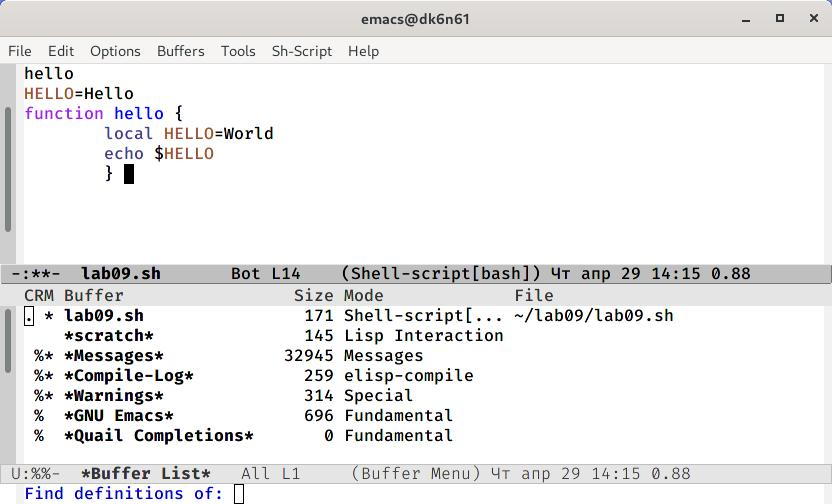
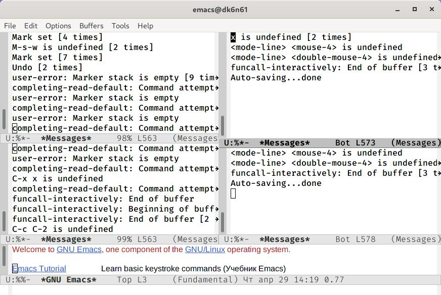
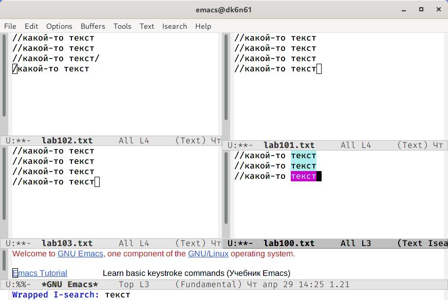

# Отчёт о выполнении лабораторной работы №10 Текстовой редактор emacs
***Российский Университет Дружбы Народов***  
***Факультет Физико-Математических и Естественных Наук***  

 ***Дисциплина:*** *Операционные системы*  
 
 ***Работу выполняла:*** *Живцова Анна*  
 
 *1032201673*  
 
 *НКНбд-01-20*  
 
 ***Москва. Дисплейный класс РУДН. 2021г.***  
 
 ---

 В ходе изучения курса "Операционные системы" передо мной встала следующая задача
 > *Познакомиться с операционной системой Linux. Получить практические навыки работы с редактором Emacs.*
 
 ---

 Данная задача была разбита на следующие подзадачи:
- создавать и редактировать файлы в emacs
- использовать горячии клавиши
- работатьь с буферами

 Изучив теоретический материал, мне удалось достигнуть поставленных целей.

 --- 

Сейчас я могу в полной мере использовать emacs для различной работы с файлами.

---

---

---

 ---
 
 # Вывод
 Познакомилась с операционной системой Linux. Получила практические навыки работы с редактором Emacs, работы с буферами и использовании горячих клавиш.

