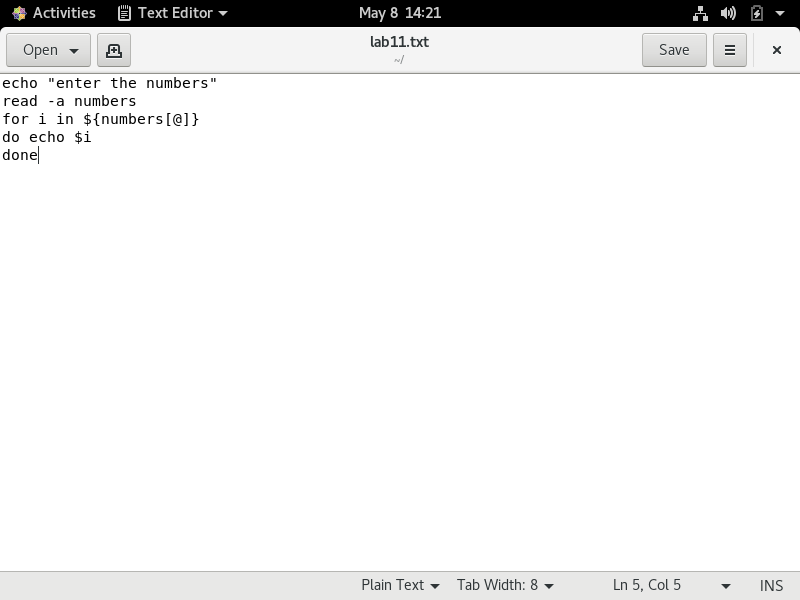
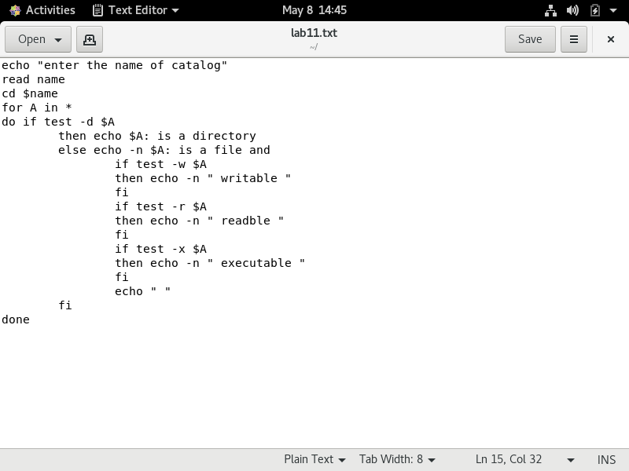

# Отчёт о выполнении лабораторной работы №11 Программирование в командном процессоре ОС UNIX. Командные файлы
***Российский Университет Дружбы Народов***  
***Факультет Физико-Математических и Естественных Наук***  

 ***Дисциплина:*** *Операционные системы*  
 
 ***Работу выполняла:*** *Живцова Анна*  
 
 *1032201673*  
 
 *НКНбд-01-20*  
 
 ***Москва. Дисплейный класс РУДН. 2021г.***  
 
 ---

 В ходе изучения курса "Операционные системы" передо мной встала следующая задача
 > *Изучить основы программирования в оболочке ОС UNIX/Linux. Научиться писать небольшие командные файлы.*
 
 ---

 Данная задача была разбита на следующие подзадачи:
- создавать скрипты для работы с файлами
- использовать специальные функции 
- передавать параметры в командные файлы
- использовать циклы и их прерывания

 Изучив теоретический материал, мне удалось достигнуть поставленных целей.

 --- 

Сейчас я могу создать необходимый командный файл или функцию для  работы в UNIX.

 ---

  ---
 
 # Вывод
 В ходе работы я приобрела ряд полезных навыков в создании командных файлов а главное создала базу для выполнения следующих лабораторных работ.

