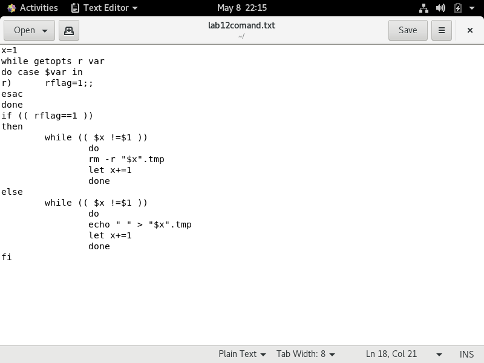
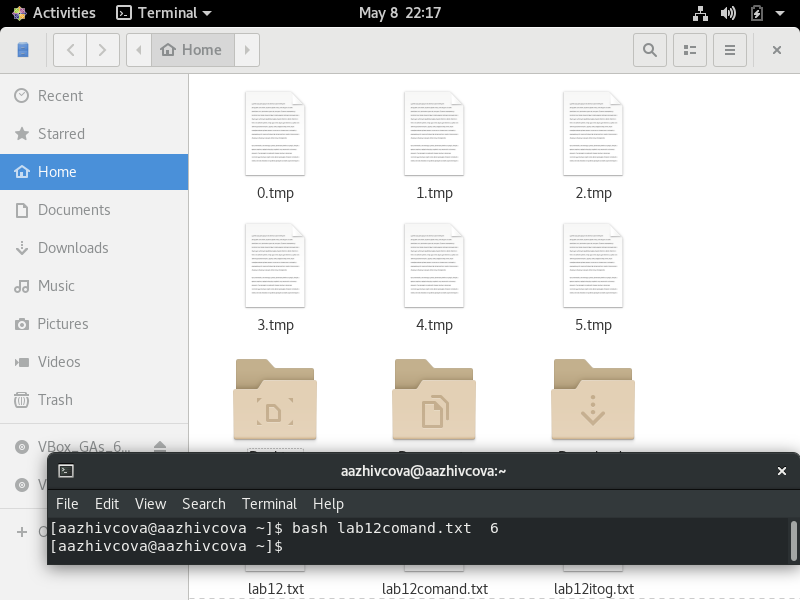
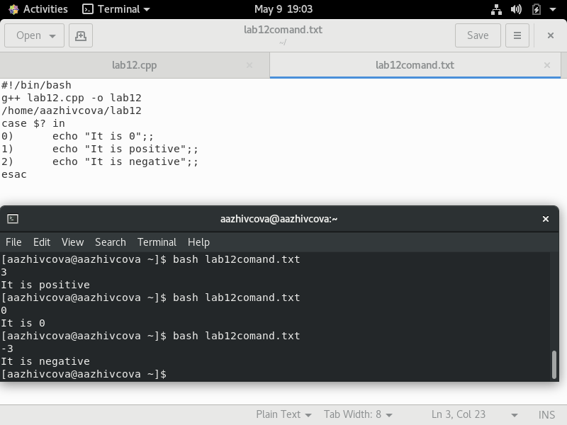
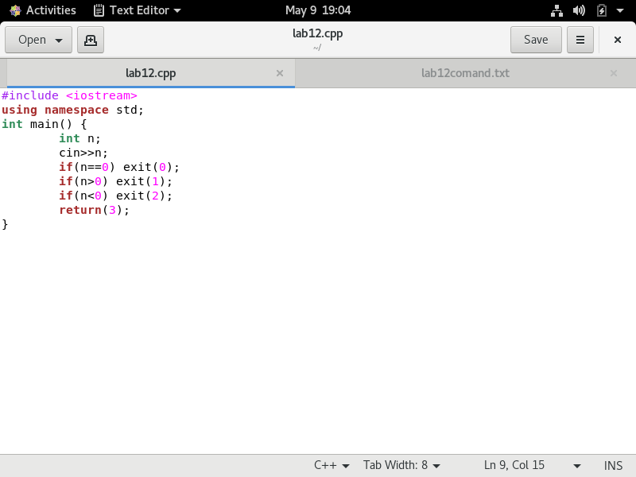

# Отчёт о выполнении лабораторной работы №12 Программирование в командном процессоре ОС UNIX. Ветвления и циклы
***Российский Университет Дружбы Народов***  
***Факультет Физико-Математических и Естественных Наук***  

 ***Дисциплина:*** *Операционные системы*  
 
 ***Работу выполняла:*** *Живцова Анна*  
 
 *1032201673*  
 
 *НКНбд-01-20*  
 
 ***Москва. Дисплейный класс РУДН. 2021г.***  
 
 ---

 В ходе изучения курса "Операционные системы" передо мной встала следующая задача
 > *Изучить основы программирования в оболочке ОС UNIX. Научится писать более сложные командные файлы с использованием логических управляющих конструкций и циклов.*
 
 ---

 Данная задача была разбита на следующие подзадачи:
- Писать командные файлы для создания, удаления и архивирования файлов
- Писать командные файлы для взаимодействия с программами

 Изучив теоретический материал, мне удалось достигнуть поставленных целей.

 --- 

Сейчас я могу писаь командные файлы облегчающие мне работу.

---

---

  

---

  

 ---
 
 # Вывод
 В хоте работы я приобрела ряд полезных навыков в написании командных файлов и работой с ОС LINUX а главное создала базу для выполнения следующих лабораторных работ.

