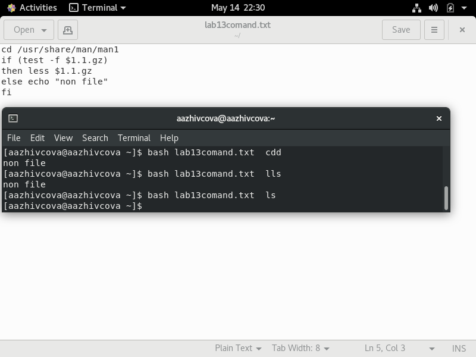
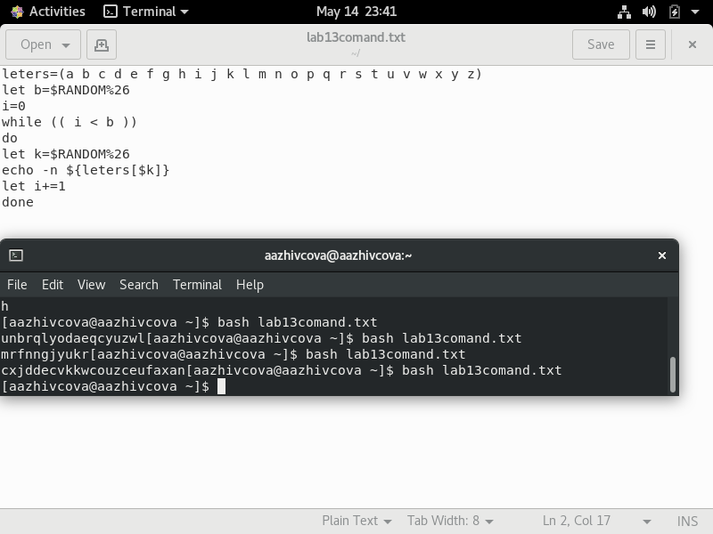

# Отчёт о выполнении лабораторной работы №13 Программирование в командном процессоре ОС UNIX. Расширенное программирование
***Российский Университет Дружбы Народов***  
***Факультет Физико-Математических и Естественных Наук***  

 ***Дисциплина:*** *Операционные системы*  
 
 ***Работу выполняла:*** *Живцова Анна*  
 
 *1032201673*  
 
 *НКНбд-01-20*  
 
 ***Москва. Дисплейный класс РУДН. 2021г.***  
 
## Цель работы 
Изучить основы программирования в оболочке ОС UNIX. Научиться писать более сложные командные файлы с использованием логических управляющих конструкций и циклов.
## Выполнение работы
1. Написала командный файл, реализующий упрощённый механизм семафоров. Командный файл в течение некоторого времени t1 дожидаться освобождения ресурса, выдавая об этом сообщение, а дождавшись его освобождения, использовать его в течение некоторого времени t2<>t1, также выдавая информацию о том, что ресурс используется соответствующим командным файлом (процессом). Запустила командный файл в одном виртуальном терминале в фоновомрежиме, перенаправив его вывод в другой (> /dev/tty#, где # — номер терминала куда перенаправляется вывод), в котором также запущен этот файл, но не фоновом, а в привилегированном режиме. Доработала программу так, чтобы имелась возможность взаимодействия трёх и более процессов.
2. Реализовала команду man с помощью командного файла. Изучила содержимое каталога /usr/share/man/man1. В нем находятся архивы текстовых файлов, содержащих справку по большинству установленных в системе программ и команд. Каждый архив можно открыть командой less сразу же просмотрев содержимое справки. Командный файл должен получать в виде аргумента командной строки название команды и в виде результата выдавать справку об этой команде или сообщение об отсутствии справки, если соответствующего файла нет в каталоге man1. (см рисунки ниже [собственная функция man](lab13/1.png) [man в действии](lab13/2.png))  


3. Используя встроенную переменную $RANDOM, написала командный файл, генерирующий случайную последовательность букв латинского алфавита. (см рисунок ниже) [генерация идет](lab13/3.png))

## Контрольные вопросы 
1.``` while ["$1" != "exit"]```
2. С помощью знака >,| можно объединить несколько строк в одну.

3. Эта утилита выводит последовательность целых чисел с заданным шагом. Также можно реализовать с помощью утилиты jot.

4. Результатом вычисления выражения $((10/3)) будет число 3.

5. В zsh можно настроить отдельные сочетания клавиш так, как вам нравится. Использование истории команд в zsh ничем особенным не отличается от bash. Zsh очень удобен для повседневной работы и делает добрую половину рутины за вас. Но стоит обратить внимание на различия между этими двумя оболочками. Например, в zsh после for обязательно вставлять пробел, нумерация массивов в zsh начинается с 1, чего совершенно невозможно понять. Так, если вы используете shell для повседневной работы, исключающей написание скриптов, используйте zsh. Если вам часто приходится писать свои скрипты, только bash! Впрочем, можно комбинировать.

6. Конструкция ```for ((a=1; a <= LIMIT; a++))``` верена.

7. в основном cpp "всего" в 2 раза быстрее, чем bash, а python намного медленнее.
## Библиография  
 https://sys.academy.lvlabwork/UNIX-practice(Y.Shamshin).pdf  
 https://sys.academy.lvlabwork/UNIX-practice(Y.Shamshin).pdf  
 https://infopedia.su/24x10498.html  

## Вывод
> Продолжила знакомство с операционной системой Linux. Получила практические навыки работы с редактором Emacs. Отредактировала созданный документ, используя комбинации клавиш.
