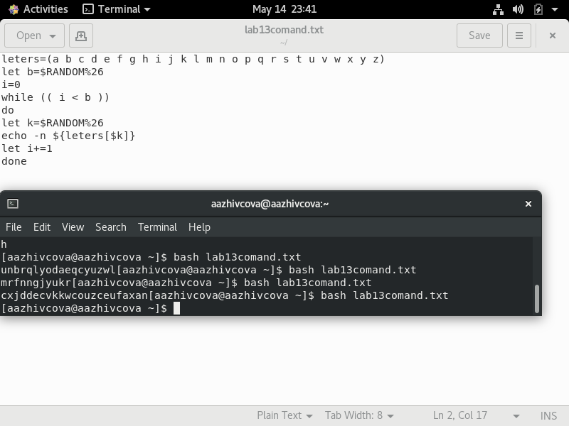

# Отчёт о выполнении лабораторной работы №13 Программирование в командном процессоре ОС UNIX. Расширенное программирование
***Российский Университет Дружбы Народов***  
***Факульткт Физико-Математических и Естественных Наук***  

 ***Дисциплина:*** *Операционные системы*  
 
 ***Работу выполняла:*** *Живцова Анна*  
 
 *1032201673*  
 
 *НКНбд-01-20*  
 
 ***Москва. Дисплейный класс РУДН. 2021г.***  
 
 ---

 В ходе изучения курса "Операционные системы" передо мной встала следующая задача
 > *Изучить основы программирования в оболочке ОС UNIX. Научиться писать более сложные командные файлы с использованием логических управляющих конструкций и циклов.*
 
 ---

 Данная задача была разбита на следующие подзадачи:
- написать аналог функции man
- написать командный файл генерирующий случайную последовательность букв
- реализовать простейший аналог семафора

 Изучив теоретический материал, мне удалось достигнуть поставленных целей.

 --- 

Сейчас я могу писать комадные файлы для различных целей.

 

 ---
 
 # Вывод
 В хоте работы я приобрела ряд полезных навыков в написании сложных командных файлов, а главное создала базу для выполнения следующих лабораторных работ.

