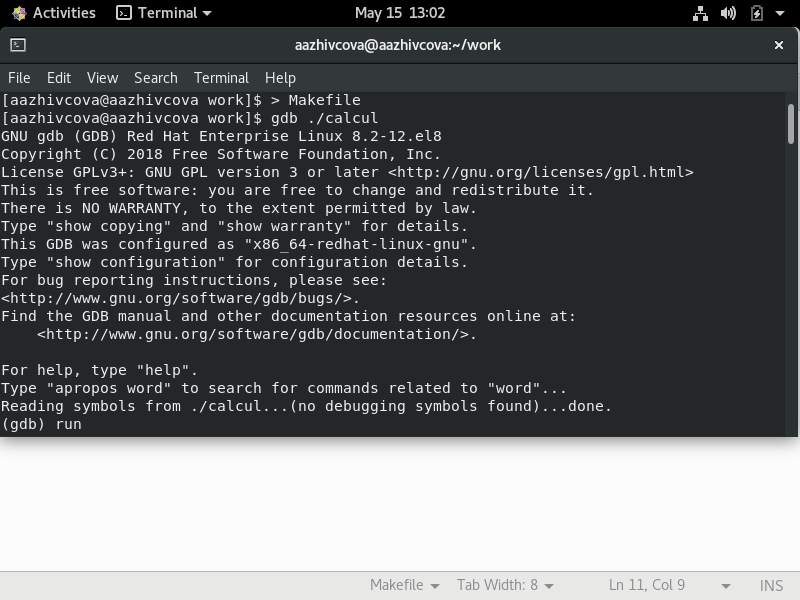

# Отчёт о выполнении лабораторной работы №14 Средства, применяемые при разработке программного обеспечения в ОС типа UNIX/Linux
***Российский Университет Дружбы Народов***  
***Факультет Физико-Математических и Естественных Наук***  

 ***Дисциплина:*** *Операционные системы*  
 
 ***Работу выполняла:*** *Живцова Анна*  
 
 *1032201673*  
 
 *НКНбд-01-20*  
 
 ***Москва. Дисплейный класс РУДН. 2021г.***  
 
## Цель работы 
Приобрести простейшие навыки разработки, анализа, тестирования и отладки приложений в ОС типа UNIX/Linux на примере создания на языке программирования С калькулятора с простейшими функциями.

## Выполнение работы
1. Создала файлы: calculate.h, calculate.c, main.c.
В них реализовала примитивнейший калькулятор, способный складывать, вычитать,умножать и делить, возводить число в степень, брать квадратный корень, вычислять sin, cos, tan. При запуске он будет запрашивать первое число, операцию, второе число. После этого программа выведет результат и останавливается. (см рисунки ниже [calculate.c](lab14/1.png) [main.c](lab14/2.png) [calculate.h](lab14/3.png) [файлы](lab14/4.png) )    

  
  
2. Выполнила компиляцию программы посредством gcc,  исправила ошибки (см рисунок ниже)
 
3. Создала Makefile  (см рисунок ниже [Makefile](lab14/7.png))  
 
в начале файла заданы три переменные: CC и CFLAGS и LIBS. Затем
указаны цели, их зависимости и соответствующие команды. В командах происходит обращение к значениям переменных. Цель с именем clean производит очистку каталога от файлов, полученных в результате компиляции. Для её описания использованы регулярные выражения.
4. С помощью gdb выполнила отладку программы calcul (перед использованием
gdb исправила Makefile (добавила -g))
    Запустила отладчик GDB, загрузив в него программу для отладки  (см рисунок ниже [выполнила отладку программы calcul](lab14/8.png))  
    
    Запустила программу (см рисунок ниже ) 
      
    Посмотрела исходный код (10 строк) (см рисунок ниже [Посмотрела исходный код](lab14/6.png) )  
      
    Посмотрела исходный код (строки с 12 по 15) (см рисунок ниже)   
    Посмотрела исходный код не основного файла (строки с 20 по 29) (см рисунок ниже [строки ОТДЕЛЬНЫЕ](lab14/10.png) )  
      
    Установила точку останова в файле calculate.c на строке номер 21  
    Вывела информацию об имеющихся в проекте точка останова (см рисунок ниже [точка останова](lab14/11.png))  
      
    Запустила программу внутри отладчика и убедилась, что программа остановится в момент прохождения точки останова (см рисунок ниже [запуск до точки](lab14/12.png))  
      
    Посмотрела, чему равно на этом этапе значение переменной, используя print и display (см рисунок ниже [значение переменной](lab14/13.png) )  
      
    Убрала точки останова (см рисунок ниже [удалила точку останова](lab14/14.png))  
        
5. 

## Контрольные вопросы  
1. Дополнительную информацию о этих программах можно получить с помощью функций info и man и help
2. Процесс разработки программного обеспечения обычно разделяется на следующие этапы:
    – планирование, включающее сбор и анализ требований к функционалу и другим характеристикам разрабатываемого приложения;  
    – проектирование, включающее в себя разработку базовых алгоритмов и спецификаций, определение языка программирования;  
    – непосредственная разработка приложения:  
    – кодирование — по сути создание исходного текста программы (возможно в нескольких вариантах);  
    – анализ разработанного кода;  
    – сборка, компиляция и разработка исполняемого модуля;  
    – тестирование и отладка, сохранение произведённых изменений;  
    – документирование.  
    Для создания исходного текста программы разработчик может воспользоваться любым удобным для него редактором текста: vi, vim, mceditor, emacs, geany и др.
    После завершения написания исходного кода программы (возможно состоящей из нескольких файлов), необходимо её скомпилировать и получить исполняемый модуль.
3. Суффикс - расширение. Например с.    
4. gcc по расширению (суффиксу) .c распознает тип файла для компиляции и формирует объектный модуль — файл с расширением .o.  
5.  Для сборки разрабатываемого приложения и собственно компиляции полезно воспользоваться утилитой make. Она позволяет автоматизировать процесс преобразования файлов программы из одной формы в другую, отслеживает взаимосвязи между файлами.  
6. target1 [target2...]:[:] [dependment1...]
    [(tab)commands] [#commentary]  
    [(tab)commands] [#commentary]  
    Здесь знак # определяет начало комментария (содержимое от знака # и до конца строки не будет обрабатываться. Одинарное двоеточие указывает на то, что последовательность команд должна содержаться в одной строке. Для переноса можно вдлинной строке команд можно использовать обратный слэш (\). Двойное двоеточие указывает на то, что последовательность команд может содержаться в нескольких последовательных строках.
    Пример более сложного синтаксиса Makefile:  

    CC = gcc  
    CFLAGS =  
    abcd: abcd.c  
    $(CC) -o abcd $(CFLAGS) abcd.c  
    clean:  
    -rm abcd *.o *~  
    В этом примере в начале файла заданы три переменные: CC и CFLAGS. Затем указаны цели, их зависимости и соответствующие команды. В командах происходит обращение к значениям переменных. Цель с именем clean производит очисткукаталога от файлов, полученных в результате компиляции. Для её описания использованы регулярные выражения.  

7. Пошаговая отладка программ заключается в том, что выполняется один оператор программы и, затем контролируются те переменные, на которые должен был воздействовать данный оператор. Если в программе имеются уже отлаженные подпрограммы, то подпрограмму можно рассматривать, как один оператор программы и воспользоваться вторым способом отладки программ. Если в программе существует достаточно большой участок программы, уже отлаженный ранее, то его можно выполнить, не контролируя переменные, на которые он воздействует. Использование точек останова позволяет пропускать уже отлаженную часть программы. Точка останова устанавливается в местах, где необходимо проверить содержимое переменных или просто проконтролировать, передаётся ли управление данному оператору. Практически во всех отладчиках поддерживается это свойство (а также выполнение программы до курсора и выход из подпрограммы). Затем отладка программы продолжается в пошаговом режиме с контролем локальных и глобальных переменных, а также внутренних регистров микроконтроллера и напряжений на выводах этой микросхемы.
8. 
    backtrace вывод на экран пути к текущей точке останова (по сутивывод названий всех функций)  
    break установить точку останова (в качестве параметра может быть указан номер строки или название функции)  
    clear удалить все точки останова в функции  
    continue продолжить выполнение программы  
    delete удалить точку останова  
    display добавить выражение в список выражений, значения которых отображаются при достижении точки останова программы  
    finish выполнить программу до момента выхода из функции  
    info breakpoints вывести на экран список используемых точек останова  
    info watchpoints вывести на экран список используемых контрольных выражений  
    list вывести на экран исходный код (в качестве параметра может быть указано название файла и через двоеточие номера начальной и конечной строк)  
    next выполнить программу пошагово, но без выполнения вызываемых в программе функций  
    print вывести значение указываемого в качестве параметра выражения  
    run запуск программы на выполнение  
    set установить новое значение переменной  
    step пошаговое выполнение программы  
    watch установить контрольное выражение, при изменении значения которого программа будет остановлена  
9. 
    1) Выполнили компиляцию программы
    2)Увидели ошибки в программе
    3) Открыли редактор и исправили программу
    4) Загрузили программу в отладчик gdb 
    5) run — отладчик выполнил программу, мы ввели требуемые значения.
    6) программа завершена, gdb не видит ошибок. 
10.  в сообшении указывался файл и строка с ошибкой, а ак же ее характер.
11.  cscope - исследование функций, содержащихся в программе; splint — критическая проверка программ, написанных на языке Си.
12. Ещё одним средством проверки исходных кодов программ, написанных на языке C, является утилита splint. Эта утилита анализирует программный код, проверяеткорректность задания аргументов использованных в программе функций и типов возвращаемых значений, обнаруживает синтаксические и семантические ошибки. В отличие от компилятора C анализатор splint генерирует комментарии с описанием разбора кода программы и осуществляет общий контроль, обнаруживая такие ошибки, как одинаковые объекты, определённые в разных файлах, или объекты, чьи значения не используются в работе программы, переменные с некорректно заданными значениями и типами и многое другое.
## Библиография  
https://web-profi.by/process-razrabotki-programmnogo-obespecheniya/  
https://habr.com/ru/post/255991/  
https://ru.wikipedia.org/wiki/Процесс_разработки_программного_обеспечения  
## Вывод
> Приобрела навыки разработки, анализа, тестирования и отладки приложений в ОС типа UNIX/Linux на примере создания на языке программирования С калькулятора с простейшими функциями.
