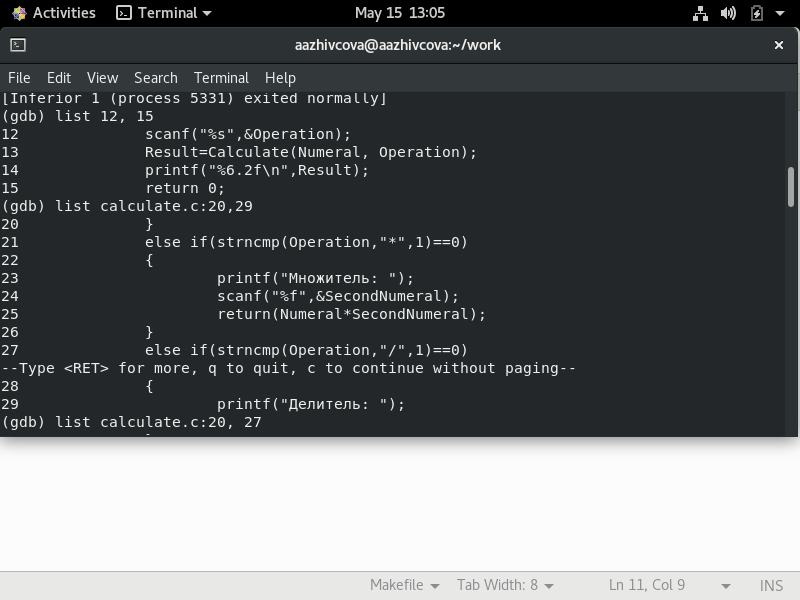

# Отчёт о выполнении лабораторной работы №14 Средства, применяемые при разработке программного обеспечения в ОС типа UNIX/Linux
***Российский Университет Дружбы Народов***  
***Факультет Физико-Математических и Естественных Наук***  

 ***Дисциплина:*** *Операционные системы*  
 
 ***Работу выполняла:*** *Живцова Анна*  
 
 *1032201673*  
 
 *НКНбд-01-20*  
 
 ***Москва. Дисплейный класс РУДН. 2021г.***  
 
 ---

 В ходе изучения курса "Операционные системы" передо мной встала следующая задача
 > *Приобрести простейшие навыки разработки, анализа, тестирования и отладки приложений в ОС типа UNIX/Linux на примере создания на языке программирования С калькулятора с простейшими функциями.*
 
 ---

 Данная задача была разбита на следующие подзадачи:
- написать программу на с
- отладить ее с омощью gdb

 Изучив теоретический материал, мне удалось достигнуть поставленных целей.

 --- 

Сейчас я могу разрабатывать и отлаживать приложения на с.

 

 ---
 
 # Вывод
 В хоте работы я приобрела ряд полезных навыков разработки, анализа, тестирования и отладки приложений в ОС типа UNIX/Linux на примере создания на языке программирования С калькулятора с простейшими функциями.

