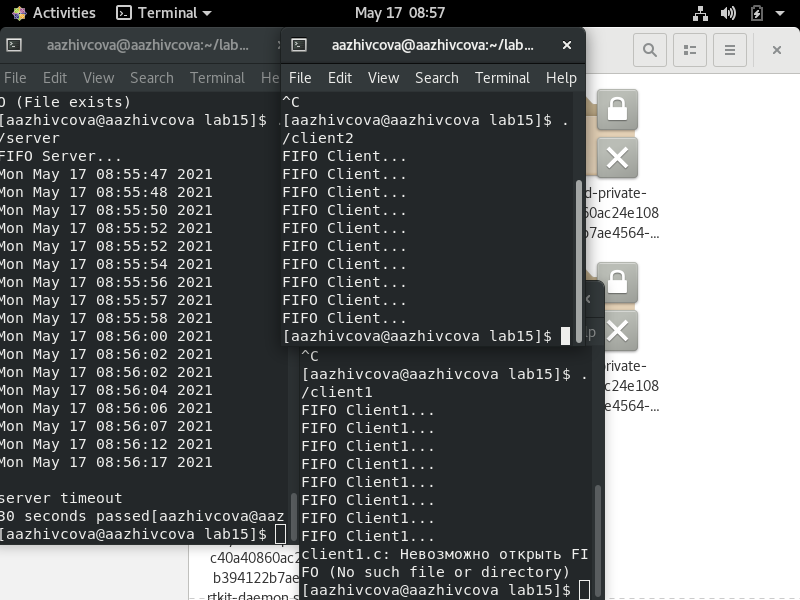
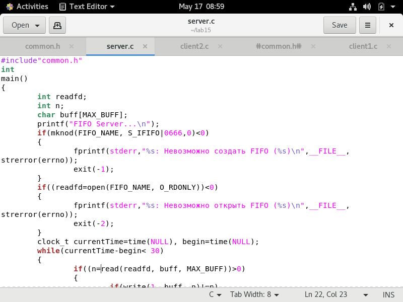

# Отчёт о выполнении лабораторной работы №15 Именованные каналы
***Факультет Физико-Математических и Естественных Наук***  

 ***Дисциплина:*** *Операционные системы*  
 
 ***Работу выполняла:*** *Живцова Анна*  
 
 *1032201673*  
 
 *НКНбд-01-20*  
 
 ***Москва. Дисплейный класс РУДН. 2021г.***  
 
## Цель работы 
Приобретение практических навыков работы с именованными каналами.

## Выполнение работы
Изучила приведённые в тексте программы server.c и client.c. Взяв данные
примеры за образец, написала аналогичные программы, внеся следующие изменения:
1. Работает не 1 клиент, а 2.
2. Клиенты передают текущее время с некоторой периодичностью.
3. Сервер работает не бесконечно, а прекращает работу через 30сек.
[работает](lab15/1.png)  
  
[сommon](lab15/2.png)  
  
[client1](lab15/3.png)  
  
[client2](lab15/4.png)  
  
[server](lab15/5.png)  
  
[server](lab15/6.png)  
  
## Контрольные вопросы 
1. Именованные каналы отличаются от неименованных наличием идентификатора канала, который представлен как специальный файл (соответственно имя именованного канала — это имя файла). Поскольку файл находится на локальной файловой системе, данное IPC используется внутри одной системы
2. Для создания неименованного канала используется системный вызов pipe. Массив из двух целых чисел является выходным параметром этого системного вызова.
3. Вызов функции mkfifo() создаёт файл канала
4. 4 int read(int pipe_fd, void *area, int cnt);  
Int write(int pipe_fd, void *area, int cnt);  
Первый аргумент этих вызовов - дескриптор канала, второй - указатель на область памяти, с которой происходит обмен, третий - количество байт. Оба вызова возвращают число переданных байт (или -1 - при ошибке).  
5. int mkfifo (const char *pathname, mode_t mode); Первый параметр — имя файла, идентифицирующего канал, второй параметр маска прав доступа к файлу. Вызов функции mkfifo() создаёт файл канала (с именем, заданным макросом FIFO_NAME): mkfifo(FIFO_NAME, 0600);  
6. При чтении меньшего числа байтов, чем находится в канале или FIFO, возвращается требуемое число байтов, остаток сохраняется для последующих чтений.  
7.  При чтении большего числа байтов, чем находится в канале или FIFO, возвращается доступное число байтов. Процесс, читающий из канала, должен соответствующим образом обработать ситуацию, когда прочитано меньше, чем заказано.  
8.  да  
9.  Функция write() переписывает count байт из буфера, на который указывает bufy в файл, соответствующий дескриптору файла handle. Указателю положения в файле дается приращение на количество записанных байт.  
10. Строковая функция strerror - функция языков C/C++, транслирующая код ошибки, который обычно хранится в глобальной переменной errno, в сообщение об ошибке, понятном человеку.  
## Библиография 
https://habr.com/ru/post/122108/  
https://www.opennet.ru/docs/RUS/linux_parallel/node17.html  
http://rus-linux.net/MyLDP/consol/An_introduction_to_pipes_in_Linux.html  
## Вывод
> Приобрела практические навыки работы с именованными каналами.
