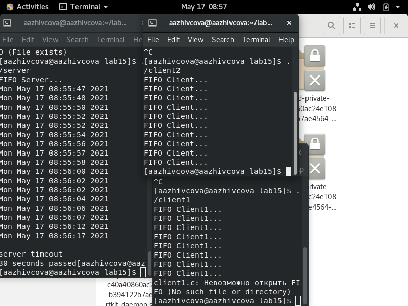

# Отчёт о выполнении лабораторной работы №15 Именованные каналы
***Российский Университет Дружбы Народов***  
***Факультет Физико-Математических и Естественных Наук***  

 ***Дисциплина:*** *Операционные системы*  
 
 ***Работу выполняла:*** *Живцова Анна*  
 
 *1032201673*  
 
 *НКНбд-01-20*  
 
 ***Москва. Дисплейный класс РУДН. 2021г.***  
 
 ---

 В ходе изучения курса "Операционные системы" передо мной встала следующая задача
 > *Приобретение практических навыков работы с именованными каналами.*
 
 ---

 Данная задача была разбита на следующие подзадачи:
- изучить теоретический матерал и примеры
- создать канал между сервером и двумя клиентами

 Изучив теоретический материал, мне удалось достигнуть поставленных целей.

 --- 

Сейчас я могу создавать именованные каналы.

 

 ---
 
 # Вывод
 В хоте работы я приобрела ряд полезных навыков в создании каналов, а главное успешно завершила выполнение всех лабораторных работ.

